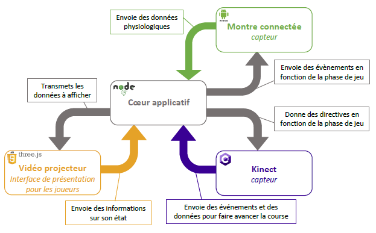

# Course de haies interactive

## Informations sur l'équipe

* Membres :
  * [Julien MAUREILLE](julien.maureille@live.fr)
  * [Gregory MERLET](gregory.merlet@outlook.fr)
  * [Pierre RAINERO](pierre.rainero@hotmail.fr)
  * [Gaulthier TOUSSAINT](gaulthiertoussaint@gmail.com)

## Architecture

## Documentation

* [Spécifications](./doc/Specifications.pdf)

## Scénario (exemple d'utilisation)

1. L’écran de projection affiche un exemple de partie montrant l’athlète courant seul (afin de donner envie aux visiteurs de venir courir avec lui) accompagné d’un message indiquant que le système est en attente de participants.
2. L’écran de projection affiche un message indiquant que le système est en attente de participants, les invitant à se placer face au capteur.
3. Les joueurs se placent sur les couloirs de couleur situés face au mur de projection : un joueur par couloir.
4. Les joueurs mettent à leur poignet la montre associée à leur couloir.
5. L’écran de projection affiche un message indiquant que le système a détecté les joueurs. Il affiche également un message invitant les joueurs à lever la main droite dès qu’ils sont prêt.
6. Chaque joueur lève la main droite.
7. Le personnage virtuel représentant le joueur lève la main.
8. Le système détecte le mouvement (Kinect) et lance la partie. L’écran de projection affiche un message “3… 2… 1 C’est parti” et lance le chronomètre pour la phase de course. Les montres connectées émettent une vibration pour indiquer aux joueurs que la course commence. L’écran affiche désormais une vue composée de :
    * Le chronomètre en haut ;
    * Une vue par joueur à la troisième personne représentant le coureur sur une piste de course avec des haies (écran divisé) ;
    * Une mini-carte d’avancement en bas à droite ou au centre de l'écran en fonction du nombre de joueurs.
9. Les joueurs doivent alors courir sur place afin de faire avancer leur personnage. Il doivent également sauter pour éviter les haies qui se présentent à eux. Le vidéoprojecteur indique le meilleur moment où le joueur doivent sauter et les montres connectés émettent une vibration si une haie est percutée.
10. Un joueur virtuel, imitant les performances d’un athlète de haut niveau, court en même temps que les participants. Sa progression est renseignée en temps réel sur la mini-carte. Ce joueur virtuel suit les performances du recordman en titre à savoir Aries Merritt.
11. Les participants portant une montre ont accès tout au long de la course à des données biométriques comme leur rythme cardiaque.
12. Dès qu’un joueur passe la ligne d’arrivée virtuelle, sa vue à la troisième personne affiche un message “Terminé !” accompagné de son classement.
13. Lorsque tous les joueurs ont passé la ligne d’arrivée, le dispositif de projection bascule sur l’écran de résultats. Ce dernier affiche pour chaque joueur son classement, sa vitesse moyenne, le nombre de haies qu’il a passé avec succès et son rythme cardiaque moyen. Il affiche également à côté les résultats (classement, vitesse moyenne, rythme cardiaque moyen) du joueur virtuel imitant un athlète.
14. Les participants ont également un récapitulatif de leur rythme cardiaque sur leur montre, il peuvent voir leurs pulsations cardiaque min, moyenne et max.
15. Au bout d’une minute, le système est réinitialisé et l’écran de projection affiche un message indiquant que le système est en attente de participants pour une nouvelle partie.
