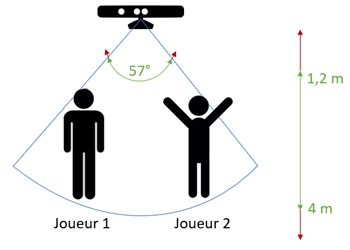

# Kinect

## Auteur

* [Pierre RAINERO](pierre.rainero@hotmail.fr)

## Description

Ce projet a pour objectif d'intéragir avec une [Kinect](https://fr.wikipedia.org/wiki/Kinect) version 1 pour extraire les informations nécessaires pour démarrer la course de haies et détecter les coureurs tout le long de celle-ci.

## Configurations préalables

Il est nécessaire que le "[backend](../backend)" soit prêt à intéragir avec cette application et que les informations pour rendre cette communication possible soient à jour. Pour cela il faut bien veiller à ce que l'url du "backend" soit correctement renseignée dans le fichier [App.config](./Kinect/App.config) :

```xml
<appSettings>
    <add key="socketIO_url" value="urlDuBackend"/>
    <add key="socketIO_port" value="portDuBackend"/>
</appSettings>
```

## Utilisation

Une fois une Kinect branchée et l'application lancée (voir [Technologies utilisées](##Technologies%20utilisées)), l'application va reconnaitre jusqu'à **2 joueurs**, respectivement "1" et "2" :  
  

1. Elle émettra la liste des joueurs sur le canal  `players` du "backend" sous la forme suivante dès que cette liste changera et tant que la partie n'aura pas démarré :

    ```json
    { "players": [{"id": 1, "state":1}, {"id": 2, "state":1}] }
    ```

2. Pour démarrer la partie il faut que chaque joueur lève sa main droite au-dessus de sa tête (de cette manière le status de chaque joueur passera à "2"). Le "backend" émettra alors un message sur le canal `kinectStartRun` à l'intention de l'application pour passer à la phase de course.

3. Une fois la partie démarrée, la kinect suivra autant que possible les joueurs (même s'ils inversent leur place). **⚠ Ceci n'est cependant pas conseillé**. A chaque fois qu'un joueur sautera (que ses deux pieds décolleront suffisamment du sol), cette application émettra un message de la sorte sur le canal `kinectPlayerJump` du "backend" :

    ```json
    { "playerId": 1 }
    ```
    En parallèle, la kinect va estimer une vitesse de course pour chaque joueur. Elle enverra de manière régulière des messages sur le canal `kinectPlayerSpeed` (pour informer le "backend" de la vitesse en mètre par seconde des joueurs) sous la forme suivante :  

    ```json
    { "players": [{"id": 1, "speed": 4.183282}, {"id": 2, "speed": 3.832008}] }
    ```

## Technologies utilisées

* [.NETFramework](https://dotnet.microsoft.com/download/dotnet-framework-runtime) 4.6.1
* [WebSocketSharp](https://www.nuget.org/packages/WebSocketSharp) 1.0.4.0
* [Kinect for Windows SDK](https://www.microsoft.com/en-gb/download/details.aspx?id=40278) 1.8
* [Kinect for Windows Developer Toolkit](https://www.microsoft.com/en-gb/download/details.aspx?id=40276) 1.8
* [log4net](https://www.nuget.org/packages/log4net/) 2.0.8